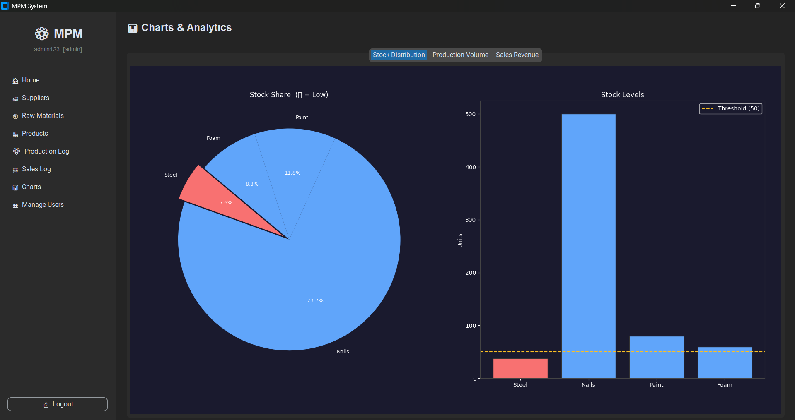

# Manufacturing Product Management System (MPM)

A full-stack DBMS project built using Python and MySQL to manage manufacturing operations including inventory, production, and sales.

---

## Features

- Role-based authentication (Admin, Manager, Operator, Viewer)
- Inventory and raw material tracking
- Product management
- Production and sales logging
- Automatic stock deduction using BOM logic
- Data visualization (charts & analytics)
- PDF report generation

---

##  Tech Stack

- Python (CustomTkinter)
- MySQL
- Pandas, Matplotlib
- Bcrypt (authentication)
- ReportLab (PDF generation)

---

##  Project Structure

frontend/ → Main application  
database/ → SQL schema  
Assets/ → Screenshots  

---

##  Setup Instructions

1. Clone the repository  
git clone https://github.com/aiv-gt/mpm-system.git  

2. Install dependencies  
pip install -r requirements.txt  

3. Setup database  
Run `database/schema.sql` in MySQL  

4. Set environment variable  
Create `.env` file:  
DB_PASSWORD=your_mysql_password  

5. Run the application  
python frontend/app.py  

---

##  Screenshots

### 📊 Charts & Analytics

---
